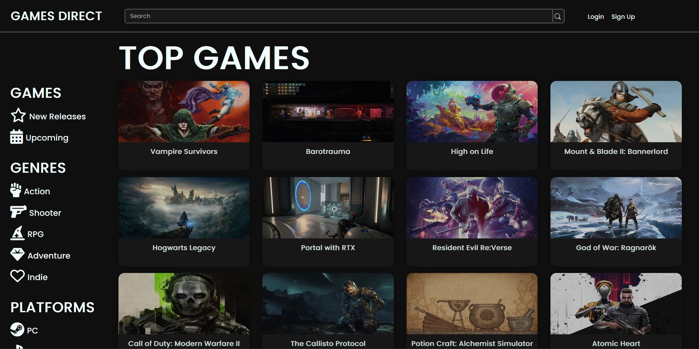

# CapstoneProject - Games Direct - Daniel Lewin
# https://games-direct.herokuapp.com/games

# About
My intention with this project was to create a video game directory using skills I have gained in Springboard's Software Engineering Career Track course. The site provides an easy and straight forward way to search and filter through games by different categories and get basic information about them, with the option of creating a basic account to add and save favorite games. As this is a student project, a lot of the code will remain commented to show my intentions. 

The site uses the following technologies:
-Python
-Flask
-Jinja
-PostgreSQL
-SQLAlchemy
-WTForms
-HTML
-CSS

# Typical User Flow
The website uses the RAWG Video Game Api(which is included below) to request different aspects about games and present them in an easy to view way. Anyone who uses the site can search for games by specific criteria such as games with specific genres (for example, Action or Shooter) or platforms (for example, PC or Playstation). Relative or similar data about a game is shown so a user can see what groups a game belongs to. This is the main use of the site as it is intended as a library, but there is some basic user functionality included that allows a user to register a profile if they wish, and with that favorite games of their choice. 

# API: 
https://rawg.io/apidocs

# Other Comments
Creating and working on this site was a lot of fun while also being quite the challenge, I learned a lot about how to structure my goals and milestones while working on a larger project. I developed better skills for making an application look appealing and consistent, and also my ability to manipulate data from an external API successfully. A great thing about this project is there is much more functionality and info I could add to it, which I may in the future, but I am satisfied with it as it is stands and am happy to submit it as is for my school's assignment.
